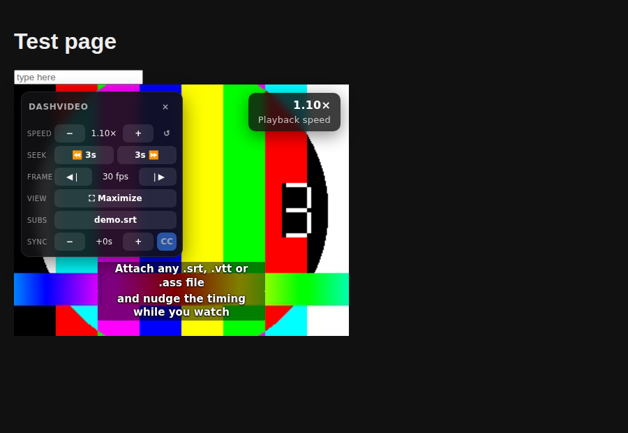

# DashVideo

A Chrome extension that puts the video controls you actually use on every
HTML5 video: custom seek intervals, frame-by-frame stepping, in-tab
maximizing, playback speed steps, hotkeys for all of it, and your own
subtitle file on top of any stream.



## Features

| | |
| --- | --- |
| **Custom seek** | Jump by your own interval (3 seconds by default) plus a second, longer jump. |
| **Frame by frame** | Steps exactly one frame at a time. The real frame rate is measured while the video plays, so 24, 25, 29.97 and 60 fps sources all step correctly. |
| **In-tab maximize** | Fills the browser tab with the video - no native fullscreen, so the rest of the browser stays put. It promotes the player, not the bare video, so the site's own controls come with it, and it survives hostile page layouts and cross-origin iframes. Fit, zoom to fill or stretch. |
| **Playback speed** | Raise and lower the speed by your own step, reset to a default, and keep the speed when a player tries to reset it. |
| **Hotkeys** | Every action is rebindable, including modifier combinations. They stay out of the way while you type. |
| **Your own subtitles** | Attach a local `.srt`, `.vtt`, `.ass`/`.ssa` or `.sbv` file to any video - including streams that ship no subtitles - and nudge the timing while you watch. |

## Install

DashVideo is a plain Manifest V3 extension with no build step:

1. Open `chrome://extensions`.
2. Turn on **Developer mode**.
3. Choose **Load unpacked** and select this folder.

## Default hotkeys

| Key | Action |
| --- | --- |
| <kbd>Z</kbd> / <kbd>X</kbd> | Seek back / forward by the custom interval (3s) |
| <kbd>Shift</kbd>+<kbd>Z</kbd> / <kbd>Shift</kbd>+<kbd>X</kbd> | Seek back / forward by the long interval (30s) |
| <kbd>,</kbd> / <kbd>.</kbd> | Previous / next frame (pauses the video) |
| <kbd>S</kbd> / <kbd>D</kbd> | Slower / faster by the speed step (0.1×) |
| <kbd>R</kbd> | Reset the speed |
| <kbd>M</kbd> | Maximize in the tab (<kbd>Esc</kbd> restores) |
| <kbd>Shift</kbd>+<kbd>M</kbd> | Cycle the picture fit: fit → zoom to fill → stretch |
| <kbd>V</kbd> | Show / hide the on-video control toolbar |
| <kbd>Shift</kbd>+<kbd>C</kbd> | Load a subtitle file |
| <kbd>C</kbd> | Show / hide the subtitles |
| <kbd>[</kbd> / <kbd>]</kbd> | Shift the subtitles earlier / later by the sync step (0.5s) |

Everything is rebindable on the options page. <kbd>Alt</kbd>+<kbd>M</kbd>,
<kbd>Alt</kbd>+<kbd>.</kbd> and <kbd>Alt</kbd>+<kbd>,</kbd> are registered as
browser-level shortcuts as well (maximize, faster, slower) and can be changed
at `chrome://extensions/shortcuts`.

Hotkeys are ignored while the focus is in a text field, a text area or any
`contenteditable` element, so site search boxes keep working.

## Maximizing

<kbd>M</kbd> fills the tab with the video and <kbd>Esc</kbd> puts the page back.
This is in-tab maximizing, not native fullscreen: the browser's own chrome stays
where it is, and so does everything else you had open.

What gets blown up is the *player*, not the bare `<video>` - the closest
ancestor that still has the video's box - so the site's own control bar, its
progress bar and its buttons come along and keep working, the way they do in
real fullscreen. When the video lives in an iframe, the frame asks its parent to
give the `<iframe>` element the same treatment, so an embedded player really
fills the tab.

<kbd>Shift</kbd>+<kbd>M</kbd> cycles how the picture fills the tab:

* **Fit** - the whole frame, with black bars where the aspect ratios differ.
* **Zoom to fill** - fills the tab edge to edge, cropping what does not fit.
  This is the one for watching 4:3 or 21:9 material without bars.
* **Stretch** - fills the tab and ignores the aspect ratio.

The choice is remembered; the options page sets the one to start from.

## Subtitles

Press <kbd>Shift</kbd>+<kbd>C</kbd> on the page, or use **Load subtitle
file…** in the popup, and pick a subtitle file from your computer. Nothing is
uploaded - the file is parsed locally and drawn over the video.

* Formats: SubRip (`.srt`), WebVTT (`.vtt`), SubStation Alpha (`.ass`, `.ssa`)
  and YouTube's `.sbv`.
* Files that are not UTF-8 fall back to windows-1252, which covers most older
  subtitle downloads.
* `[` and `]` shift the timing live while you watch; the offset is shown in the
  panel and the popup.
* Size, colour, background opacity, position and outline are configurable on
  the options page, with a live preview.
* Cues are drawn by DashVideo instead of being handed to the player, so they
  work on cross-origin streams and survive players that rebuild their own text
  tracks. They are held in memory for the tab: reloading the page clears them.

## Settings

The popup carries the same controls in a roomier form, plus the seek interval,
long seek, speed step and frame rate. The options page has everything else:
the full hotkey editor, the speed range and default, subtitle appearance,
on-screen feedback, and a per-site block list for pages where DashVideo should
stay out of the way.

## How it works

* `src/content/` is injected into every frame at `document_start`. It finds the
  video the user means (largest, visible, playing - shadow DOM included), keeps
  its playback rate, and measures the frame rate with
  `requestVideoFrameCallback`.
* The overlay - toast, speed badge, control toolbar and subtitles - lives in a
  shadow root, so page CSS cannot reach it and it cannot leak into the page.
  The chrome is deliberately slim and pinned to the top edge of the video: a
  one-line toolbar (28px tall, draggable by its grip and clamped to the video)
  centred at the top, the speed badge in the corner and the toast just below
  them. Only the subtitles sit at the bottom.
* Maximizing pins the player with inline `!important` styles and wipes every
  ancestor above it with `all: initial`. That last part is the whole trick: an
  ancestor that forms a stacking context - a transform, a filter, `isolation`,
  or just a flex item with a `z-index` - traps a fixed descendant inside it, so
  no z-index is high enough to get the video on top and you end up looking at a
  black rectangle. Removing the stacking contexts outright is what the Windowed
  extension does, and it is what works. The `style` attribute of every element
  touched is stashed whole and put back on exit.
* Hotkeys pressed in the top frame are relayed down to the frame that owns the
  video, and a frame that maximizes asks its parent to promote the `<iframe>`
  element it lives in.

## Development

```bash
node --test tests/*.test.js     # subtitle parsing and hotkey matching
node tests/browser/run.mjs      # end to end in a real Chromium (needs Playwright)
python3 tools/make-icons.py     # regenerate the icons
```

The browser suite loads the extension into Chromium and drives it against
deliberately hostile pages - stacking contexts, paint containment, letterboxing
players, cross-origin embeds. See `tests/browser/README.md`.

There is no bundler, no dependency and no build output - the folder you clone
is the folder you load.

```
manifest.json
src/common/      defaults, settings storage, hotkey matching (shared everywhere)
src/content/     video detection, actions, overlay UI, maximize, subtitles
src/popup/       toolbar popup
src/options/     settings and hotkey editor
src/background/  browser-level command handling
tools/           icon generator
tests/           node --test suite, plus the Chromium checks in tests/browser/
```

## Limitations

* Chrome does not let extensions touch DRM-protected pixels, so the subtitle
  overlay and the maximize treatment work on Netflix-style players, but the
  frame stepping precision depends on what the player exposes.
* Frame stepping is as accurate as the source: variable-frame-rate videos have
  no single frame duration, so DashVideo uses the measured average.
* Pages that block extension content scripts (the Chrome Web Store,
  `chrome://` pages) are out of reach for any extension, DashVideo included.
